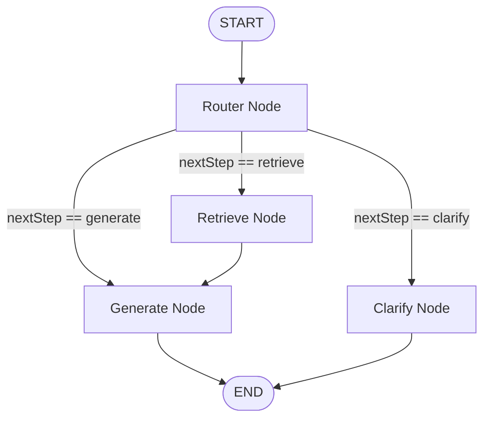

# NGO RAG Explorer 🤖 (Powered by LangGraph & Groq)

Este es un proyecto RAG (Retrieval-Augmented Generation) enfocado en la exploración y consulta inteligente de ONGs latinoamericanas. Está construido de forma moderna utilizando **Next.js 15 (App Router)**, **LangGraph (TypeScript)** y **Groq SDK** (utilizando modelos Llama 3).

La aplicación cuenta con una interfaz web premium de chat (CSS Vanilla, Glassmorphic, Dark Mode) y un backend estructurado como un flujo de agentes seguro mediante grafos de estado.

---

## 📁 Estructura del Proyecto

El proyecto está organizado de la siguiente manera:

```
hakelton/
├── data/
│   └── ngos.json           # Base de datos mock con datos detallados de ONGs y proyectos.
├── lib/
│   └── langgraph/
│       └── graph.ts        # Definición de la lógica del agente, nodos y grafo de LangGraph.
├── app/
│   ├── api/
│   │   └── chat/
│   │       └── route.ts    # Endpoint de la API que recibe y ejecuta el flujo del grafo.
│   ├── globals.css         # Estilos premium (glassmorphism, animaciones, tema oscuro).
│   ├── layout.tsx          # Layout principal e inyección de tipografías de Google Fonts.
│   └── page.tsx            # Componente de chat interactivo, sugerencias y barra lateral.
├── .env                    # Variables de entorno (GROQ_API_KEY).
├── package.json            # Scripts de ejecución y dependencias del sistema.
├── tsconfig.json           # Configuración de TypeScript.
└── next.config.ts          # Configuración del servidor Next.js.
```

---

## 🤖 Arquitectura del Grafo de Estado (LangGraph)

El procesamiento de cada mensaje pasa por un Grafo de Estado (`StateGraph`) que orquesta el flujo RAG de manera determinista y segura:



### Funciones y Nodos Implementados:

1. **`routerNode` (Clasificador de Intención)**:
   Utiliza `llama-3.1-8b-instant` con estructuración de salida JSON para clasificar la consulta del usuario en 3 flujos:
   - **`retrieve`**: La pregunta requiere consultar detalles del mock de ONGs.
   - **`generate`**: Es una pregunta sobre el contexto de la conversación o conceptual que no requiere nueva búsqueda en base de datos.
   - **`clarify`**: Filtro de seguridad que intercepta saludos, off-topic, inyecciones de prompt e intentos de solicitud de código.

2. **`retrieveNode` (Buscador Semántico-Fuzzy)**:
   Analiza el archivo `data/ngos.json` buscando coincidencias por palabras clave cruzadas en nombre, enfoque, misión y proyectos de las ONGs. Pondera las coincidencias para ordenar por relevancia y genera un contexto Markdown para el LLM.

3. **`generateNode` (Generador RAG)**:
   Invoca a `llama-3.3-70b-versatile` cargando el contexto recuperado de las ONGs y el historial de mensajes de forma segura para dar una respuesta estructurada en Markdown.

4. **`clarifyNode` (Guardrail de Seguridad y UX)**:
   Utiliza `llama-3.1-8b-instant` para interceptar de forma amigable e ingeniosa intentos de jailbreak, solicitudes de código o preguntas fuera de ámbito (ej: recetas, programación, datos de identidad), redirigiendo cordialmente al usuario de vuelta a las ONGs.

---

## 🚀 Guía de Instalación y Ejecución

### Prerrequisitos
- Node.js (v18 o superior)
- npm o yarn

### Pasos
1. Clona o ubícate en la carpeta del proyecto `../hakelton`.
2. Asegúrate de configurar la variable de entorno en tu archivo `.env`:
   ```env
   GROQ_API_KEY=tu_api_key_de_groq_aqui
   ```
3. Instala las dependencias del proyecto:
   ```bash
   npm install
   ```
4. Levanta el servidor de desarrollo (configurado por defecto en el puerto `3001` para evitar colisiones):
   ```bash
   npm run dev
   ```
5. Abre en tu navegador: **[http://localhost:3001](http://localhost:3001)**

---

## 📈 Guía para Escalar al Proyecto Real (Paso a Paso)

Para convertir este prototipo mock en un sistema RAG de producción vectorial en Supabase, sigue los siguientes pasos técnicos:

### 1. Migración del Mock JSON a Supabase Vector Database
En lugar de buscar en un archivo JSON local, utilizaremos una extensión de PostgreSQL llamada `pgvector` en Supabase.

1. **Activar pgvector en Supabase**:
   Ejecuta esto en el editor SQL de Supabase:
   ```sql
   create extension if not exists vector;
   ```

2. **Crear la tabla de documentos vectorizados**:
   ```sql
   create table ngo_embeddings (
     id bigserial primary key,
     ngo_id text,
     content text, -- Fragmento de texto descriptivo de la ONG
     metadata jsonb, -- Metadatos del fragmento (nombre, sede, área, presupuesto)
     embedding vector(1536) -- Vector de 1536 dimensiones (estándar para text-embedding-3-small de OpenAI)
   );
   ```

3. **Crear la función de búsqueda por similitud de cosenos**:
   ```sql
   create or replace function match_ngos (
     query_embedding vector(1536),
     match_threshold float,
     match_count int
   )
   returns table (
     id bigint,
     ngo_id text,
     content text,
     metadata jsonb,
     similarity float
   )
   language sql stable
   as $$
     select
       ngo_embeddings.id,
       ngo_embeddings.ngo_id,
       ngo_embeddings.content,
       ngo_embeddings.metadata,
       1 - (ngo_embeddings.embedding <=> query_embedding) as similarity
     from ngo_embeddings
     where 1 - (ngo_embeddings.embedding <=> query_embedding) > match_threshold
     order by ngo_embeddings.embedding <=> query_embedding
     limit match_count;
   $$;
   ```

---

### 2. Actualización de Dependencias
Instala los paquetes para gestionar bases de datos vectoriales y embeddings en Node.js:
```bash
npm install @supabase/supabase-js @langchain/openai @langchain/community
```

---

### 3. Reemplazar el Nodo `retrieveNode` con Búsqueda Vectorial
En tu archivo `lib/langgraph/graph.ts`, actualiza la lógica de recuperación para llamar a Supabase:

```typescript
import { createClient } from "@supabase/supabase-js";
import { OpenAIEmbeddings } from "@langchain/openai";

// Inicializar clientes
const supabase = createClient(
  process.env.NEXT_PUBLIC_SUPABASE_URL!,
  process.env.SUPABASE_SERVICE_ROLE_KEY!
);

const embeddings = new OpenAIEmbeddings({
  apiKey: process.env.OPENAI_API_KEY,
  modelName: "text-embedding-3-small",
});

// Función de consulta vectorial que reemplaza a retrieveNgos local
async function retrieveVectorNgos(queryStr: string): Promise<string> {
  try {
    // 1. Generar el embedding vectorial para la consulta del usuario
    const queryVector = await embeddings.embedQuery(queryStr);

    // 2. Consultar similitud en Supabase
    const { data: matchedDocuments, error } = await supabase.rpc("match_ngos", {
      query_embedding: queryVector,
      match_threshold: 0.65, // Nivel mínimo de similitud
      match_count: 4,        // Cantidad de fragmentos a recuperar
    });

    if (error) throw error;
    if (!matchedDocuments || matchedDocuments.length === 0) {
      return "No se encontraron documentos relevantes en la base de datos vectorial.";
    }

    // 3. Formatear los resultados para el prompt del LLM
    return matchedDocuments
      .map((doc: any, idx: number) => {
        const meta = doc.metadata;
        return `Documento [${idx + 1}] (ONG: ${meta.ngo_name}):\n${doc.content}`;
      })
      .join("\n\n");
  } catch (error) {
    console.error("Error recuperando de Supabase pgvector:", error);
    return "Error al buscar en la base de datos vectorial de ONGs.";
  }
}

// Actualizar el nodo de recuperación en tu LangGraph
async function retrieveNode(state: typeof AgentState.State) {
  const query = state.query;
  const contextStr = await retrieveVectorNgos(query);

  return {
    context: contextStr,
    nextStep: "generate" as const
  };
}
```

---

### 4. Persistencia del Historial del Chat (Nativo en LangGraph)
En este prototipo mock, el cliente envía todo el historial. En producción, puedes delegar el almacenamiento de la memoria directamente a LangGraph utilizando **Checkpointers**:

1. **Instalar el checkpointer de PostgreSQL**:
   ```bash
   npm install @langchain/langgraph-checkpoint-postgres
   ```

2. **Compilar el grafo con persistencia**:
   ```typescript
   import { PostgresSaver } from "@langchain/langgraph-checkpoint-postgres";
   
   // Inicializar saver con la pool de postgres
   const checkpointer = PostgresSaver.fromConnString(process.env.DATABASE_URL!);
   
   // Compilar grafo pasando el checkpointer
   export const ngoGraph = workflow.compile({ checkpointer });
   ```

3. **Ejecutar el chat pasando un identificador de sesión (`thread_id`)**:
   ```typescript
   const config = { configurable: { thread_id: "user-session-abc-123" } };
   const result = await ngoGraph.invoke({ messages: [nuevoMensajeUsuario] }, config);
   ```
   *Esto guardará automáticamente los mensajes de cada usuario en base de datos, manteniendo sesiones persistentes y limpias.*
