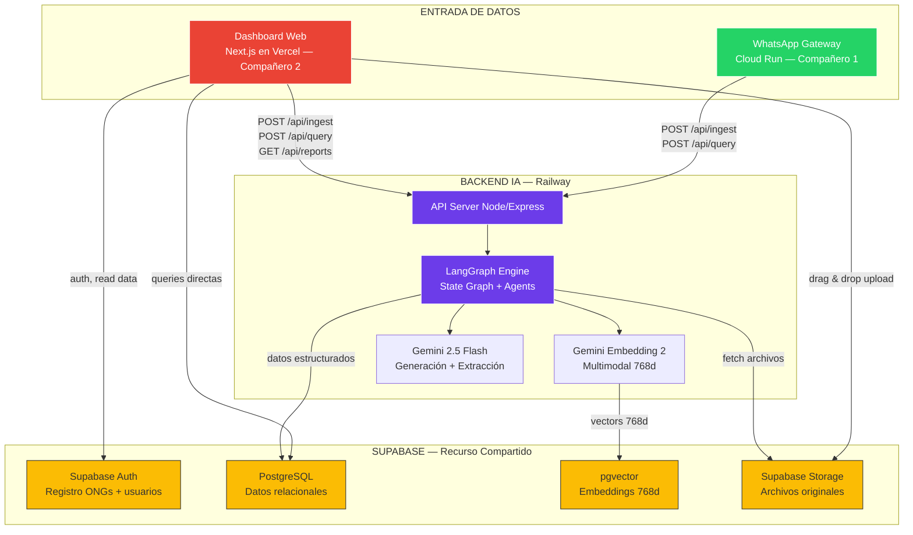
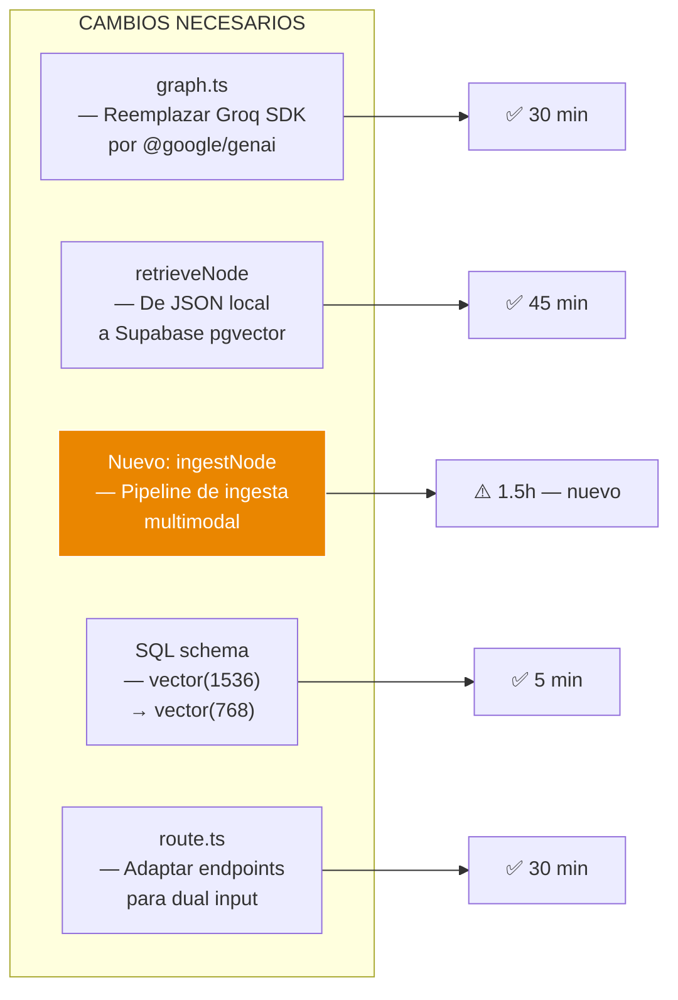
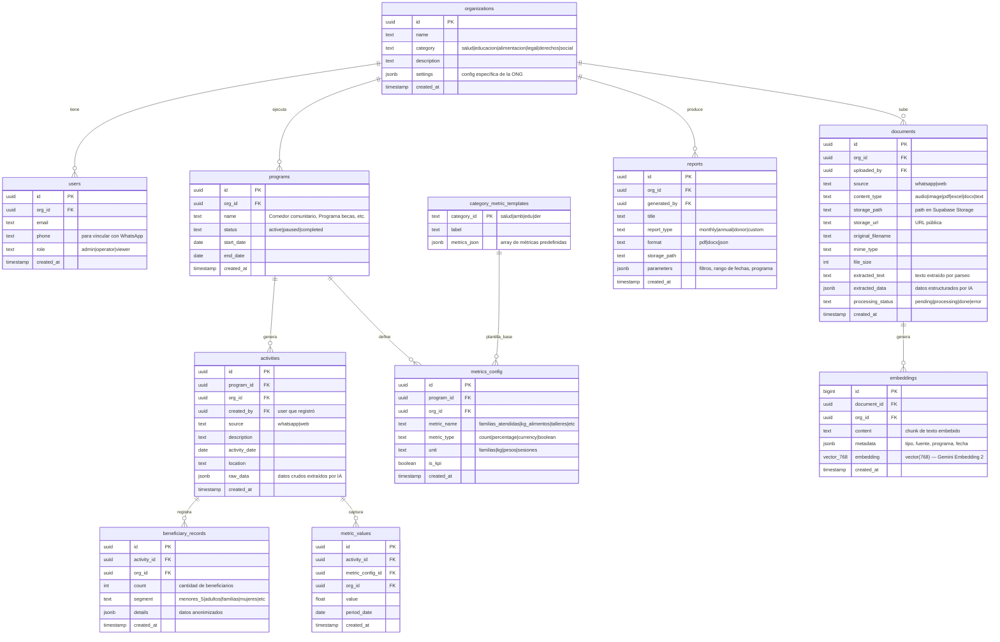
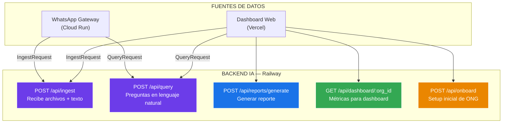
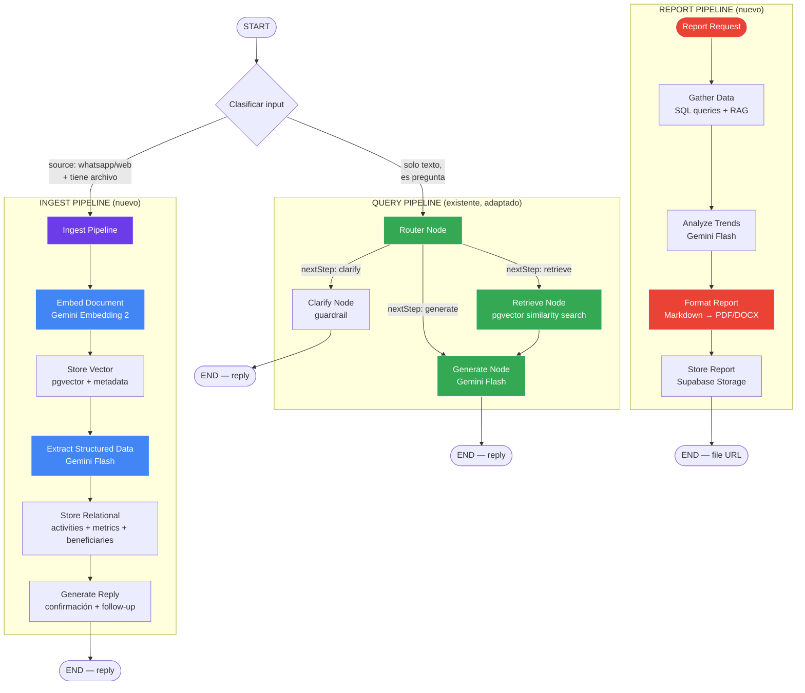
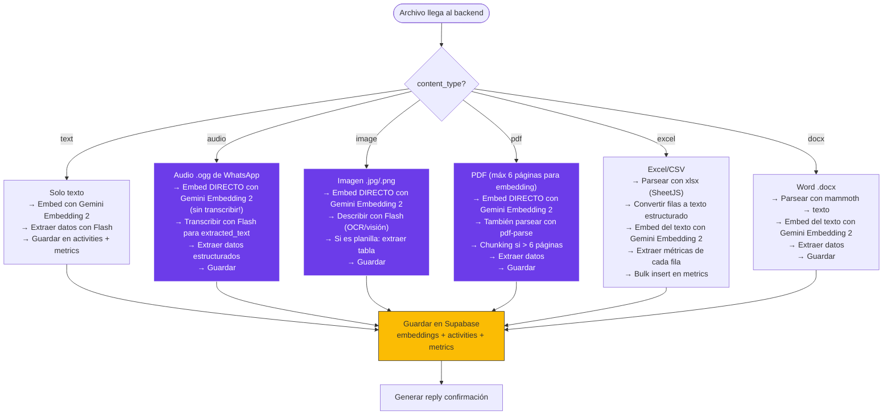
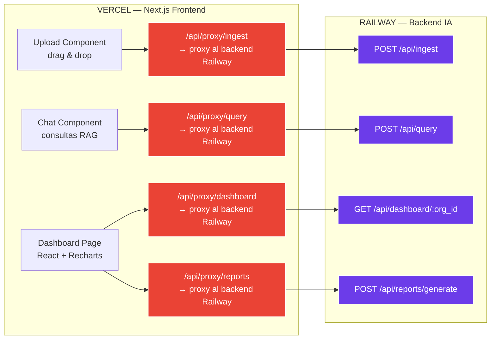
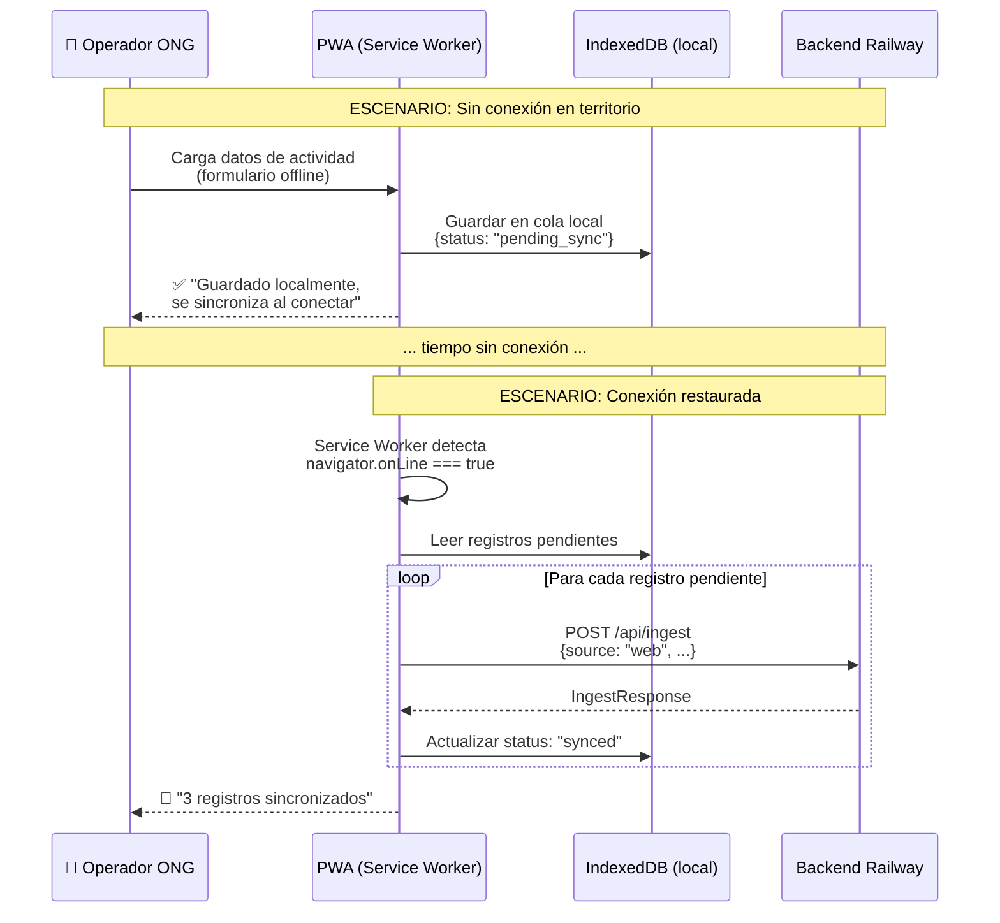
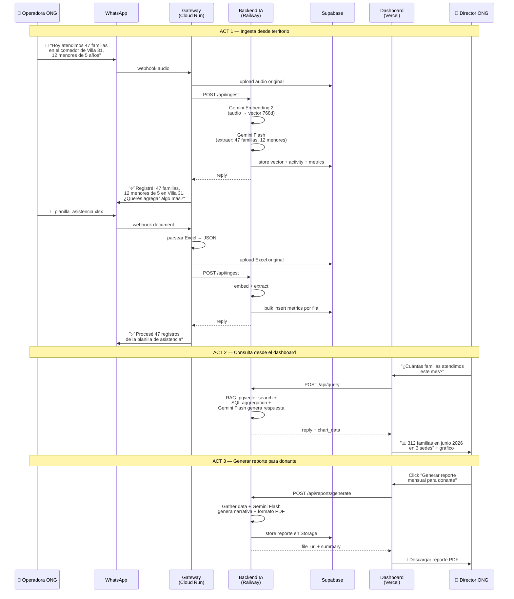

# Arquitectura Técnica — Backend IA + Plataforma de Reportes

## Hackathon Solidaria · Track 3 — Impacto y Reportes

**Responsable:** Compañero (Backend IA + Frontend)  
**Fecha:** 6 de junio de 2026  
**Alcance:** Backend LangGraph en Railway + Frontend Next.js en Vercel + Supabase

---

## 1. Visión General — Topología de Servicios

El sistema se compone de **3 servicios** y **1 recurso compartido**:



### Deploy Split

| Servicio | Plataforma | Razón |
|---|---|---|
| Frontend (Next.js + Dashboard + PWA) | **Vercel** | SSR/ISR optimizado, CDN global, preview deploys |
| Backend IA (LangGraph + Node) | **Railway** | Sin timeout limit, procesos long-running (30s+), WebSocket support |
| WhatsApp Gateway | **Cloud Run** | Lo maneja el compañero 1 |
| Base de datos + Storage | **Supabase** | Compartido entre todos los servicios |

---

## 2. Migración de Stack — De Groq/Llama a Gemini

El prototipo actual usa Groq (Llama 3) + planea OpenAI embeddings.  
Para la hackathon, se migra **todo a Gemini**:

| Componente | Antes (prototipo) | Ahora (hackathon) | Razón del cambio |
|---|---|---|---|
| **LLM generación** | Groq SDK + Llama 3.3 70B | Gemini 2.5 Flash | Free tier generoso, multimodal nativo, mejor en español |
| **LLM router/clasificación** | Groq + Llama 3.1 8B | Gemini 2.5 Flash (mismo modelo, prompt distinto) | Simplificar a un solo proveedor |
| **Embeddings** | OpenAI text-embedding-3-small (1536d) | Gemini Embedding 2 (768d, multimodal) | Embeddea audio, imagen, PDF directo sin conversión |
| **Vector dimensions** | 1536 | **768** | Mismo rendimiento, 50% menos storage |
| **Búsqueda** | Fuzzy en JSON local | Similarity search en pgvector | Producción real |

### Impacto en el código existente



---

## 3. Esquema de Base de Datos — Supabase PostgreSQL + pgvector

### 3.1 Activar pgvector

```sql
CREATE EXTENSION IF NOT EXISTS vector;
```

### 3.2 Tablas relacionales



### 3.3 SQL — Crear tabla de embeddings con pgvector

```sql
-- Tabla de embeddings multimodal (Gemini Embedding 2 @ 768 dims)
CREATE TABLE embeddings (
  id BIGSERIAL PRIMARY KEY,
  document_id UUID REFERENCES documents(id) ON DELETE CASCADE,
  org_id UUID REFERENCES organizations(id) NOT NULL,
  content TEXT NOT NULL,
  metadata JSONB DEFAULT '{}',
  embedding VECTOR(768) NOT NULL,
  created_at TIMESTAMPTZ DEFAULT NOW()
);

-- Índice HNSW para búsqueda rápida por similitud coseno
CREATE INDEX ON embeddings
  USING hnsw (embedding vector_cosine_ops)
  WITH (m = 16, ef_construction = 64);

-- Row Level Security: cada ONG solo ve sus embeddings
ALTER TABLE embeddings ENABLE ROW LEVEL SECURITY;

CREATE POLICY "org_isolation" ON embeddings
  FOR ALL USING (org_id = auth.jwt() ->> 'org_id');
```

### 3.4 Función de búsqueda semántica (RPC)

```sql
CREATE OR REPLACE FUNCTION match_documents(
  query_embedding VECTOR(768),
  target_org_id UUID,
  match_threshold FLOAT DEFAULT 0.65,
  match_count INT DEFAULT 5
)
RETURNS TABLE (
  id BIGINT,
  document_id UUID,
  content TEXT,
  metadata JSONB,
  similarity FLOAT
)
LANGUAGE sql STABLE
AS $$
  SELECT
    embeddings.id,
    embeddings.document_id,
    embeddings.content,
    embeddings.metadata,
    1 - (embeddings.embedding <=> query_embedding) AS similarity
  FROM embeddings
  WHERE
    embeddings.org_id = target_org_id
    AND 1 - (embeddings.embedding <=> query_embedding) > match_threshold
  ORDER BY embeddings.embedding <=> query_embedding
  LIMIT match_count;
$$;
```

---

## 4. APIs que debe exponer el Backend IA (Railway)

El backend en Railway recibe requests de **dos fuentes** distintas con formatos unificados:



### 4.1 `POST /api/ingest` — Recibir y procesar archivos

Este endpoint recibe datos tanto del WhatsApp Gateway como del dashboard web.

```typescript
// ============================================
// REQUEST — Payload que recibe el backend
// ============================================
interface IngestRequest {
  // --- Identificación ---
  message_id: string;             // ID único (UUID del gateway o generado por web)
  org_id: string;                 // UUID de la organización
  sender_id: string;              // UUID del user o phone hasheado
  source: "whatsapp" | "web";     // Origen del dato
  timestamp: string;              // ISO 8601

  // --- Contenido ---
  content_type: "text" | "audio" | "image" | "pdf" | "excel" | "docx";

  // Texto del mensaje (siempre presente, puede ser caption)
  text_content: string | null;

  // Archivo adjunto (si aplica)
  file?: {
    storage_url: string;          // URL pública en Supabase Storage
    storage_path: string;         // Path: originals/org123/2026-06-06/file.ogg
    mime_type: string;            // "audio/ogg", "image/jpeg", "application/pdf"
    file_name: string;            // Nombre original
    file_size: number;            // Bytes
    file_base64?: string;         // Base64 para Gemini Embedding 2 (WhatsApp lo manda)
  };

  // Preprocesamiento hecho por el gateway (solo WhatsApp)
  preprocessed?: {
    extracted_text?: string;      // Texto extraído de PDF/Excel/Docx
    excel_json?: Record<string, any>[];  // Filas del Excel como JSON
  };

  // Contexto conversacional (solo WhatsApp)
  conversation_id?: string;       // Para mantener estado en LangGraph
}

// ============================================
// RESPONSE — Lo que el backend devuelve
// ============================================
interface IngestResponse {
  status: "ok" | "error" | "processing";
  
  // Respuesta para enviar al usuario (WhatsApp) o mostrar en web
  reply_message: string;
  reply_type: "text" | "document";
  reply_file_url?: string;        // Si genera un archivo de vuelta
  
  // Datos extraídos por la IA (el Gateway no los usa, pero el frontend sí)
  extracted_data?: {
    activity?: {
      description: string;
      date: string;
      location?: string;
      program_id?: string;
    };
    beneficiaries?: {
      total: number;
      segments: Record<string, number>;  // {"menores_5": 12, "adultos": 35}
    };
    metrics?: Record<string, number>;    // {"kg_alimentos": 250, "familias": 47}
    entities?: Record<string, string>;   // Entidades nombradas extraídas
  };

  // IDs de los registros creados en Supabase
  created_records?: {
    document_id: string;
    activity_id?: string;
    embedding_ids: string[];
  };

  error?: string;
}
```

### 4.2 `POST /api/query` — Preguntas en lenguaje natural

```typescript
// ============================================
// REQUEST
// ============================================
interface QueryRequest {
  message_id: string;
  org_id: string;
  sender_id: string;
  source: "whatsapp" | "web";
  message: string;                // La pregunta del usuario
  conversation_id?: string;       // Estado de LangGraph (WhatsApp)
  
  // Filtros opcionales (desde la web, el usuario puede acotar)
  filters?: {
    program_id?: string;
    date_from?: string;           // ISO date
    date_to?: string;
    content_types?: string[];     // ["audio", "pdf"]
  };
}

// ============================================
// RESPONSE
// ============================================
interface QueryResponse {
  status: "ok" | "error";
  reply_message: string;          // Respuesta en markdown
  reply_type: "text" | "document" | "chart_data";

  // Si reply_type === "chart_data", incluir datos para el dashboard
  chart_data?: {
    type: "bar" | "line" | "pie" | "metric";
    title: string;
    data: Record<string, any>[];
    x_key?: string;
    y_key?: string;
  };

  // Fuentes usadas por el RAG
  sources?: {
    document_id: string;
    content_preview: string;      // Primeros 100 chars
    content_type: string;
    similarity_score: number;
    storage_url?: string;
  }[];

  reply_file_url?: string;
  error?: string;
}
```

### 4.3 `POST /api/reports/generate` — Generar reportes

```typescript
// ============================================
// REQUEST
// ============================================
interface ReportGenerateRequest {
  org_id: string;
  requested_by: string;           // UUID del user
  
  report_type: "monthly" | "annual" | "donor" | "custom";
  format: "pdf" | "docx" | "json";
  language: "es" | "en";          // Algunos donors piden reportes en inglés
  
  parameters: {
    date_from: string;
    date_to: string;
    program_ids?: string[];       // Filtrar por programas específicos
    include_beneficiary_details: boolean;  // false = solo métricas agregadas
    donor_name?: string;          // Para personalizar el reporte
    template_id?: string;         // Plantilla del financiador (futuro)
  };
}

// ============================================
// RESPONSE
// ============================================
interface ReportGenerateResponse {
  status: "ok" | "generating" | "error";
  report_id: string;              // UUID del reporte generado
  file_url?: string;              // URL de descarga en Supabase Storage
  
  // Resumen del reporte (para mostrar preview en el dashboard)
  summary?: {
    title: string;
    period: string;
    total_activities: number;
    total_beneficiaries: number;
    key_metrics: Record<string, number>;
    highlights: string[];         // Logros principales generados por IA
  };

  error?: string;
}
```

### 4.4 `GET /api/dashboard/:org_id` — Métricas para dashboard

```typescript
// ============================================
// QUERY PARAMS
// ============================================
// GET /api/dashboard/org123?period=month&date=2026-06
// GET /api/dashboard/org123?period=year&date=2026
// GET /api/dashboard/org123?period=custom&from=2026-01-01&to=2026-06-06

// ============================================
// RESPONSE
// ============================================
interface DashboardResponse {
  org_id: string;
  org_name: string;
  org_category: string;
  period: string;

  // KPIs principales (dinámicos según categoría de ONG)
  kpis: {
    metric_name: string;          // "Familias atendidas"
    value: number;
    unit: string;                 // "familias"
    trend: "up" | "down" | "stable";
    trend_percent: number;        // vs período anterior
    is_primary: boolean;          // KPI principal destacado
  }[];

  // Datos para gráficos
  charts: {
    id: string;
    type: "bar" | "line" | "pie" | "stacked_bar";
    title: string;
    data: Record<string, any>[];
    x_key: string;
    y_key: string;
    group_key?: string;           // Para stacked
  }[];

  // Actividad reciente
  recent_activities: {
    id: string;
    description: string;
    date: string;
    source: "whatsapp" | "web";
    beneficiary_count: number;
    program_name: string;
  }[];

  // Resumen generado por IA
  ai_summary: string;             // "En junio 2026, la organización atendió..."
}
```

### 4.5 `POST /api/onboard` — Setup inicial de ONG

```typescript
// ============================================
// REQUEST
// ============================================
interface OnboardRequest {
  org_name: string;
  category: "salud" | "educacion" | "alimentacion" | "legal" | "derechos" 
           | "discapacidad" | "genero" | "ambiental" | "social" | "otro";
  admin_email: string;
  admin_phone?: string;

  // Programas iniciales (opcionales, pueden agregar después)
  initial_programs?: {
    name: string;
    description?: string;
  }[];
}

// ============================================
// RESPONSE
// ============================================
interface OnboardResponse {
  status: "ok" | "error";
  org_id: string;
  
  // Métricas pre-configuradas según categoría
  suggested_metrics: {
    metric_name: string;
    metric_type: string;
    unit: string;
    is_kpi: boolean;
  }[];

  // Mensaje de bienvenida para WhatsApp
  whatsapp_welcome_message: string;
  whatsapp_number: string;        // Número del bot para agregar

  error?: string;
}
```

### Métricas sugeridas por categoría de ONG

```typescript
const METRICS_BY_CATEGORY: Record<string, MetricTemplate[]> = {
  salud: [
    { name: "Pacientes atendidos", type: "count", unit: "personas", is_kpi: true },
    { name: "Consultas realizadas", type: "count", unit: "consultas", is_kpi: true },
    { name: "Derivaciones", type: "count", unit: "derivaciones", is_kpi: false },
    { name: "Mamografías", type: "count", unit: "estudios", is_kpi: false },
    { name: "Ecografías", type: "count", unit: "estudios", is_kpi: false },
  ],
  alimentacion: [
    { name: "Familias atendidas", type: "count", unit: "familias", is_kpi: true },
    { name: "Raciones entregadas", type: "count", unit: "raciones", is_kpi: true },
    { name: "Kg de alimentos", type: "count", unit: "kg", is_kpi: true },
    { name: "Menores alimentados", type: "count", unit: "niños", is_kpi: false },
    { name: "Voluntarios activos", type: "count", unit: "personas", is_kpi: false },
  ],
  educacion: [
    { name: "Alumnos inscriptos", type: "count", unit: "alumnos", is_kpi: true },
    { name: "Talleres dictados", type: "count", unit: "talleres", is_kpi: true },
    { name: "Horas de formación", type: "count", unit: "horas", is_kpi: false },
    { name: "Tasa de finalización", type: "percentage", unit: "%", is_kpi: true },
    { name: "Becas otorgadas", type: "count", unit: "becas", is_kpi: false },
  ],
  legal: [
    { name: "Casos activos", type: "count", unit: "casos", is_kpi: true },
    { name: "Consultas jurídicas", type: "count", unit: "consultas", is_kpi: true },
    { name: "Casos resueltos", type: "count", unit: "casos", is_kpi: true },
    { name: "Patrocinios legales", type: "count", unit: "patrocinios", is_kpi: false },
    { name: "Incidencia en política pública", type: "count", unit: "acciones", is_kpi: false },
  ],
  // ... más categorías
};
```

---

## 5. LangGraph — Arquitectura del Grafo Actualizada

El grafo actual (router → retrieve → generate → clarify) se extiende con un **pipeline de ingesta** para procesar archivos multimodales.

### 5.1 Grafo completo



### 5.2 State Schema del Grafo

```typescript
import { Annotation, StateGraph } from "@langchain/langgraph";

// State que fluye por todo el grafo
const AgentState = Annotation.Root({
  // --- Input ---
  source: Annotation<"whatsapp" | "web">,
  org_id: Annotation<string>,
  sender_id: Annotation<string>,
  conversation_id: Annotation<string | undefined>,
  
  // --- Content ---
  input_type: Annotation<"ingest" | "query" | "report">,
  content_type: Annotation<string>,        // "text" | "audio" | "image" | "pdf" | "excel" | "docx"
  text_content: Annotation<string | null>,
  file_base64: Annotation<string | null>,
  file_mime_type: Annotation<string | null>,
  file_storage_path: Annotation<string | null>,
  preprocessed_text: Annotation<string | null>,
  
  // --- Processing ---
  embedding: Annotation<number[] | null>,  // vector 768d
  extracted_data: Annotation<Record<string, any> | null>,
  retrieved_context: Annotation<string | null>,
  
  // --- Routing ---
  next_step: Annotation<"retrieve" | "generate" | "clarify" | "ingest">,
  
  // --- Output ---
  reply_message: Annotation<string>,
  reply_type: Annotation<"text" | "document" | "chart_data">,
  created_records: Annotation<Record<string, any> | null>,
  
  // --- Conversation history (LangGraph checkpointer) ---
  messages: Annotation<any[]>,
});
```

### 5.3 Nodo de Embedding Multimodal — Gemini Embedding 2

```typescript
import { GoogleGenAI } from "@google/genai";

const genai = new GoogleGenAI({ apiKey: process.env.GEMINI_API_KEY });

/**
 * embedDocumentNode — Embeddea cualquier formato con Gemini Embedding 2
 * 
 * CLAVE: No necesita transcribir audio ni describir imágenes.
 * Gemini Embedding 2 recibe el binario directo y genera el vector.
 */
async function embedDocumentNode(state: typeof AgentState.State) {
  const parts: any[] = [];

  // 1. Si hay texto, agregarlo como part
  if (state.text_content) {
    parts.push({ text: state.text_content });
  }

  // 2. Si hay archivo binario, agregarlo como inline data
  if (state.file_base64 && state.file_mime_type) {
    // Mapeo de MIME types soportados por Gemini Embedding 2
    const SUPPORTED_MIME: Record<string, string> = {
      "audio/ogg":  "audio/ogg",
      "audio/mpeg": "audio/mpeg",
      "audio/wav":  "audio/wav",
      "image/jpeg": "image/jpeg",
      "image/png":  "image/png",
      "image/webp": "image/webp",
      "application/pdf": "application/pdf",
    };

    const mimeType = SUPPORTED_MIME[state.file_mime_type];

    if (mimeType) {
      // Embedding multimodal directo — sin conversión intermedia
      parts.push({
        inlineData: {
          mimeType,
          data: state.file_base64,
        },
      });
    } else {
      // Para Excel/Docx: usar el texto preprocesado que envió el gateway
      if (state.preprocessed_text) {
        parts.push({ text: state.preprocessed_text });
      }
    }
  }

  // 3. Llamar a Gemini Embedding 2
  const result = await genai.models.embedContent({
    model: "gemini-embedding-2-preview",
    contents: [{ parts }],
    config: {
      taskType: "RETRIEVAL_DOCUMENT",  // Optimizado para ser encontrado después
      outputDimensionality: 768,        // Balance óptimo rendimiento/storage
    },
  });

  return {
    embedding: result.embeddings?.[0]?.values ?? null,
  };
}
```

### 5.4 Nodo de Extracción Estructurada — Gemini Flash

```typescript
/**
 * extractStructuredDataNode — Extrae datos estructurados del contenido
 * 
 * Usa Gemini Flash para entender qué datos relevantes tiene el documento
 * y mapearlos a la estructura de la ONG (actividades, beneficiarios, métricas)
 */
async function extractStructuredDataNode(state: typeof AgentState.State) {
  // Obtener la config de métricas de esta ONG
  const { data: metricsConfig } = await supabase
    .from("metrics_config")
    .select("metric_name, metric_type, unit")
    .eq("org_id", state.org_id);

  const metricNames = metricsConfig?.map(m => m.metric_name).join(", ") || "beneficiarios, actividades";

  // Construir el input para Gemini Flash
  let contentDescription = "";
  if (state.text_content) contentDescription += `Mensaje: ${state.text_content}\n`;
  if (state.preprocessed_text) contentDescription += `Contenido extraído: ${state.preprocessed_text}\n`;
  if (state.content_type === "audio") contentDescription += `[Audio enviado por WhatsApp — contenido embebido]\n`;
  if (state.content_type === "image") contentDescription += `[Imagen enviada — posiblemente planilla o foto de actividad]\n`;

  const prompt = `Sos un asistente de una ONG argentina. Analizá el siguiente contenido y extraé datos estructurados.

MÉTRICAS QUE ESTA ONG REGISTRA: ${metricNames}

CONTENIDO RECIBIDO:
${contentDescription}

Respondé SOLO con JSON válido, sin markdown ni explicación:
{
  "activity": {
    "description": "descripción breve de la actividad",
    "date": "YYYY-MM-DD o null si no se menciona",
    "location": "lugar o null"
  },
  "beneficiaries": {
    "total": número_o_null,
    "segments": { "segmento": cantidad }
  },
  "metrics": { "nombre_metrica": valor_numerico },
  "confidence": 0.0-1.0
}`;

  const response = await genai.models.generateContent({
    model: "gemini-2.5-flash",
    contents: [{ parts: [{ text: prompt }] }],
    config: {
      responseMimeType: "application/json",
    },
  });

  const text = response.candidates?.[0]?.content?.parts?.[0]?.text || "{}";
  
  try {
    const extracted = JSON.parse(text.replace(/```json|```/g, "").trim());
    return { extracted_data: extracted };
  } catch {
    return { extracted_data: null };
  }
}
```

---

## 6. Pipeline de Ingesta por Formato — Qué pasa con cada tipo



### Consideraciones por formato

| Formato | Embedding directo con Gemini E2 | Parseo adicional necesario | Límites Gemini E2 |
|---|---|---|---|
| **Texto** | ✅ Sí | No | 8,192 tokens |
| **Audio** | ✅ Sí (sin transcribir) | Flash para transcripción textual + extracción | Máx 80 segundos |
| **Imagen** | ✅ Sí (sin describir) | Flash para OCR/visión si es planilla | Máx 6 imágenes/request |
| **PDF** | ✅ Sí | pdf-parse como fallback para PDFs largos | Máx 6 páginas |
| **Excel** | ❌ No nativo | `xlsx` (SheetJS) → texto → embed | Convertir a texto primero |
| **Word** | ❌ No nativo | `mammoth` → texto → embed | Convertir a texto primero |

---

## 7. Estructura del Proyecto — Backend Railway

```
backend-ia/
├── src/
│   ├── server.ts                        # Entry point Express/Fastify
│   ├── routes/
│   │   ├── ingest.ts                    # POST /api/ingest
│   │   ├── query.ts                     # POST /api/query
│   │   ├── reports.ts                   # POST /api/reports/generate
│   │   ├── dashboard.ts                 # GET /api/dashboard/:org_id
│   │   └── onboard.ts                  # POST /api/onboard
│   ├── langgraph/
│   │   ├── graph.ts                     # Definición del StateGraph principal
│   │   ├── state.ts                     # AgentState schema
│   │   ├── nodes/
│   │   │   ├── classifier.ts            # Clasifica input: ingest vs query
│   │   │   ├── router.ts               # Router de queries (retrieve/generate/clarify)
│   │   │   ├── embed-document.ts        # Gemini Embedding 2 multimodal
│   │   │   ├── extract-structured.ts    # Gemini Flash → datos estructurados
│   │   │   ├── store-vector.ts          # Guardar en pgvector
│   │   │   ├── store-relational.ts      # Guardar en tablas relacionales
│   │   │   ├── retrieve.ts             # RAG search en pgvector
│   │   │   ├── generate.ts             # Generar respuesta con Gemini Flash
│   │   │   ├── clarify.ts              # Guardrail de seguridad
│   │   │   └── generate-reply.ts        # Generar reply de confirmación
│   │   └── pipelines/
│   │       ├── ingest-pipeline.ts       # Sub-grafo de ingesta
│   │       ├── query-pipeline.ts        # Sub-grafo de consulta
│   │       └── report-pipeline.ts       # Sub-grafo de reportes
│   ├── lib/
│   │   ├── gemini/
│   │   │   ├── embedding.ts             # Wrapper Gemini Embedding 2
│   │   │   └── flash.ts                # Wrapper Gemini Flash
│   │   ├── supabase/
│   │   │   ├── client.ts               # Supabase client
│   │   │   ├── storage.ts              # Fetch archivos de Storage
│   │   │   └── vectors.ts              # Operaciones pgvector (match_documents RPC)
│   │   ├── parsers/
│   │   │   ├── pdf-parser.ts            # pdf-parse
│   │   │   ├── excel-parser.ts          # xlsx (SheetJS)
│   │   │   └── docx-parser.ts           # mammoth
│   │   └── reports/
│   │       ├── generator.ts             # Lógica de generación de reportes
│   │       ├── templates.ts             # Templates por tipo de reporte
│   │       └── pdf-builder.ts           # Markdown → PDF
│   ├── config/
│   │   ├── metrics-templates.ts         # Métricas por categoría de ONG
│   │   └── prompts.ts                  # System prompts centralizados
│   └── types/
│       ├── api.ts                       # Tipos compartidos de API
│       ├── database.ts                  # Tipos de Supabase
│       └── langgraph.ts                # Tipos del State
├── Dockerfile
├── .env.example
├── package.json
└── tsconfig.json
```

---

## 8. Frontend Next.js — Endpoints internos (Vercel)

El frontend en Vercel NO corre LangGraph. Usa API routes livianas que actúan como proxy al backend Railway:



**¿Por qué proxy?** Vercel API routes actúan como proxy ligero (< 10s) porque solo reenvían el request al backend Railway. El procesamiento pesado ocurre en Railway sin timeout.

Para uploads grandes desde la web, el frontend sube directo a Supabase Storage (client-side) y luego envía solo la URL al backend.

---

## 9. PWA Offline — Estrategia de Sincronización



### Implementación mínima para hackathon

```typescript
// service-worker.ts — Background sync
self.addEventListener("sync", (event: SyncEvent) => {
  if (event.tag === "sync-pending-activities") {
    event.waitUntil(syncPendingActivities());
  }
});

async function syncPendingActivities() {
  const db = await openDB("ngo-offline", 1);
  const pending = await db.getAllFromIndex("activities", "status", "pending_sync");

  for (const record of pending) {
    try {
      await fetch(`${BACKEND_URL}/api/ingest`, {
        method: "POST",
        headers: { "Content-Type": "application/json" },
        body: JSON.stringify(record.payload),
      });
      await db.put("activities", { ...record, status: "synced" });
    } catch {
      // Se reintenta en el próximo sync
      break;
    }
  }
}
```

---

## 10. Variables de Entorno — Backend Railway

```env
# === GEMINI ===
GEMINI_API_KEY=your_gemini_api_key          # Google AI Studio API key

# === SUPABASE ===
NEXT_PUBLIC_SUPABASE_URL=https://xxxxx.supabase.co
SUPABASE_SERVICE_ROLE_KEY=your_service_role_key
DATABASE_URL=postgresql://...                # Para LangGraph checkpointer

# === INTER-SERVICE AUTH ===
GATEWAY_API_KEY=shared_secret_with_whatsapp  # Validar requests del Gateway
FRONTEND_API_KEY=shared_secret_with_frontend # Validar requests del frontend

# === GENERAL ===
NODE_ENV=production
PORT=3000
LOG_LEVEL=info
```

---

## 11. Flujo Completo End-to-End — Demo de la Hackathon



---

## 12. Dependencias — package.json del Backend Railway

```json
{
  "name": "ngo-impact-backend",
  "private": true,
  "scripts": {
    "dev": "tsx watch src/server.ts",
    "build": "tsc",
    "start": "node dist/server.js"
  },
  "dependencies": {
    "@google/genai": "^1.0.0",
    "@langchain/langgraph": "^0.2.0",
    "@langchain/langgraph-checkpoint-postgres": "^0.1.0",
    "@langchain/core": "^0.3.0",
    "@supabase/supabase-js": "^2.45.0",
    "express": "^4.21.0",
    "cors": "^2.8.5",
    "pdf-parse": "^1.1.1",
    "xlsx": "^0.18.5",
    "mammoth": "^1.8.0",
    "zod": "^3.23.0",
    "uuid": "^10.0.0"
  },
  "devDependencies": {
    "@types/express": "^5.0.0",
    "@types/node": "^22.0.0",
    "tsx": "^4.19.0",
    "typescript": "^5.6.0"
  }
}
```

---

## 13. Checklist Pre-Hackathon — Compañero Backend

- [ ] Crear proyecto en Railway y vincular repo
- [ ] Migrar SDK de Groq a `@google/genai` (Gemini Flash)
- [ ] Obtener API key de Gemini en Google AI Studio
- [ ] Crear tablas en Supabase (SQL de sección 3)
- [ ] Crear función `match_documents` en Supabase (RPC)
- [ ] Crear bucket `whatsapp-ingesta` en Supabase Storage
- [ ] Acordar con compañero 1 los contratos API exactos (sección 4)
- [ ] Testear Gemini Embedding 2 con un audio y una imagen
- [ ] Configurar LangGraph checkpointer con PostgreSQL
- [ ] Definir templates de métricas por categoría (sección 4.5)
- [ ] Configurar CORS para aceptar requests de Vercel + Cloud Run

---

*Documento generado para la Hackathon Solidaria — Track 3 · Impacto y Reportes*  
*Arquitectura del Backend IA + Plataforma de Reportes · Junio 2026*